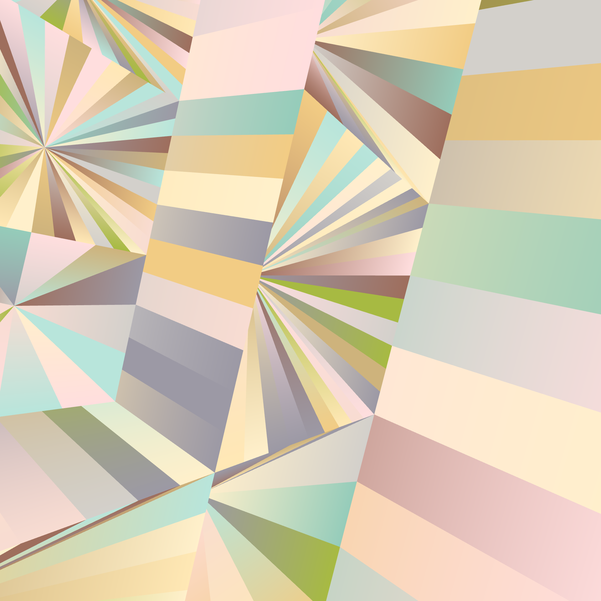
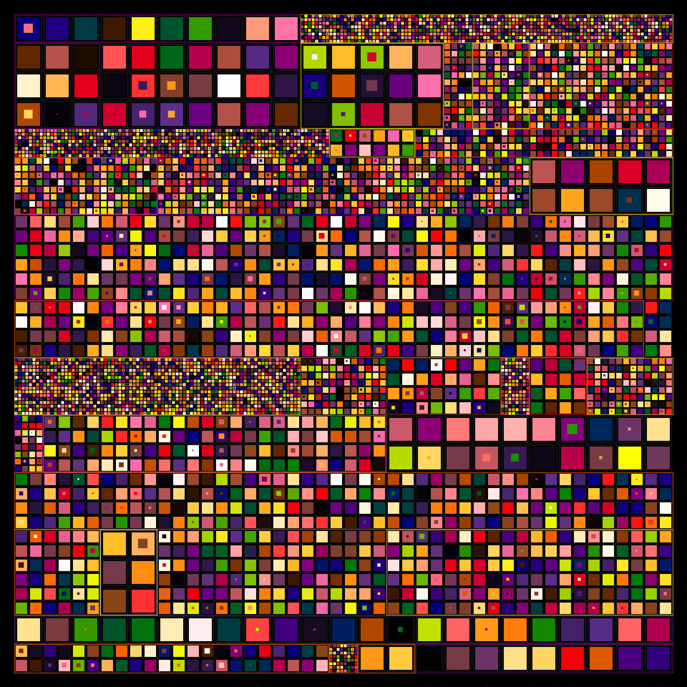

# Generative Art Collection

A collection of generative art algorithms implemented in TypeScript using [p5.js](https://p5js.org/).



## Overview

This project contains a variety of generative art algorithms, each creating unique visual patterns and compositions. The codebase has been structured to allow for easy experimentation and extension, with shared utilities for common operations like color management, canvas sizing, and image saving.

## Getting Started

### Prerequisites

- [Bun](https://bun.sh/) (latest version recommended)
- A modern web browser

### Installation

1. Clone the repository:
   ```bash
   git clone https://github.com/yourusername/generative-art.git
   cd generative-art
   ```

2. Install dependencies:
   ```bash
   bun install
   ```

3. Start the development server:
   ```bash
   bun run dev
   ```

4. Open your browser and navigate to the local URL shown in your terminal (typically `http://localhost:5173`)

## Project Structure

```
generative-art/
├── algorithms/              # Individual generative art algorithms
├── data/                    # Shared data files
│   └── colorsPalettes.ts    # Color palettes for different algorithms
├── helpers/                 # Shared utility functions
│   ├── canvasDimensions.ts  # Canvas sizing utilities
│   ├── colorUtils.ts        # Color manipulation utilities
│   ├── keyboardControls.ts  # Keyboard interaction utilities
│   └── saveImage.ts         # Image saving utilities
├── settings.ts              # Global settings (algorithm selection, canvas dimensions)
├── main.ts                  # Main entry point that loads the selected algorithm
├── index.html               # Main HTML entry point
└── style.css                # Global styles
```

## Algorithms

### Azulejos

A generative algorithm inspired by Portuguese azulejos tiles, creating geometric patterns with recursive subdivision.



### Circo

Creates 3D cylindrical structures with color interpolation and random height segments.

### Eyes_004

Generates eye-like patterns with concentric circles and arcs, creating an organic, watching effect.

### Mondrian

Inspired by Piet Mondrian's neoplasticism style, generating compositions with primary colors and black grid lines.

### Op_prob1

Creates optical illusion patterns with checkerboard designs and noise-based variations.

## Usage

### Switching Algorithms

To switch between algorithms, simply edit the `settings.ts` file and change the `CURRENT_ALGORITHM` value:

```typescript
export const CURRENT_ALGORITHM = "mondrian"
```

The value should match the name of the folder in the `algorithms` directory.

### Canvas Dimensions

You can set canvas dimensions by modifying the constants in `settings.ts`:

```typescript
// Canvas dimensions
export const CANVAS_WIDTH = 960
export const CANVAS_HEIGHT = 960
```
If these constants are commented out, the canvas will use the window dimensions.

### Keyboard Controls

All sketches support the following keyboard controls:
- **Space**: Generate a new variation with a random seed
- **S**: Save the current canvas as a PNG image
